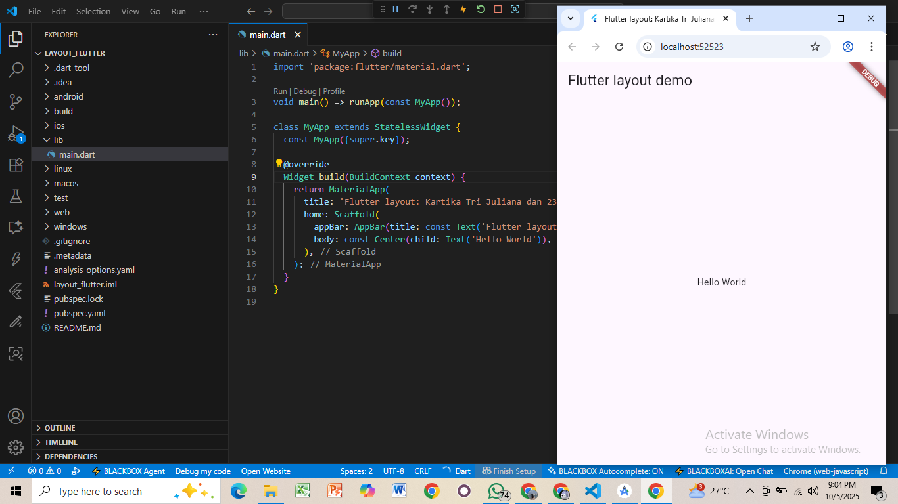
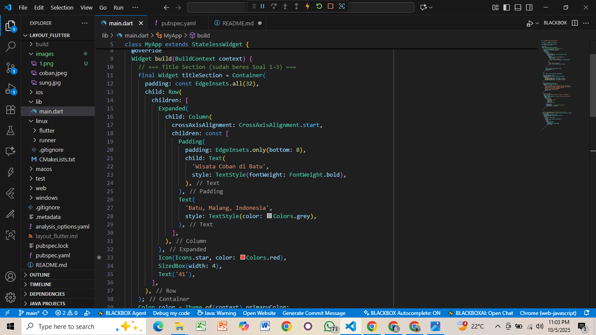
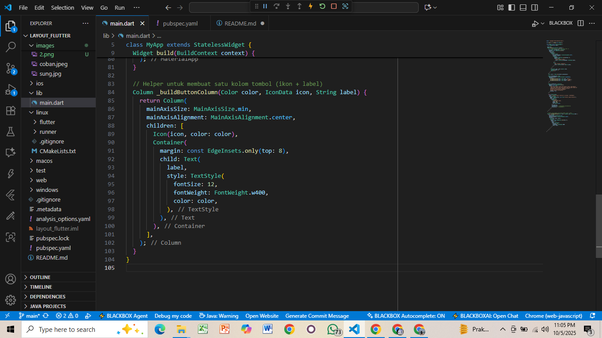
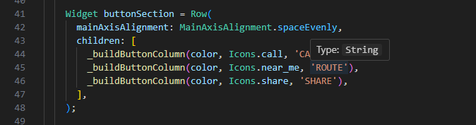
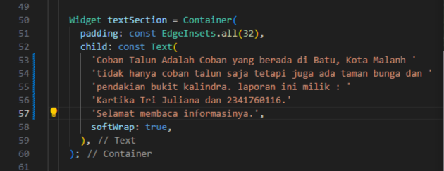
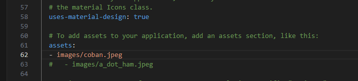
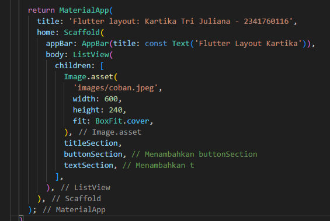
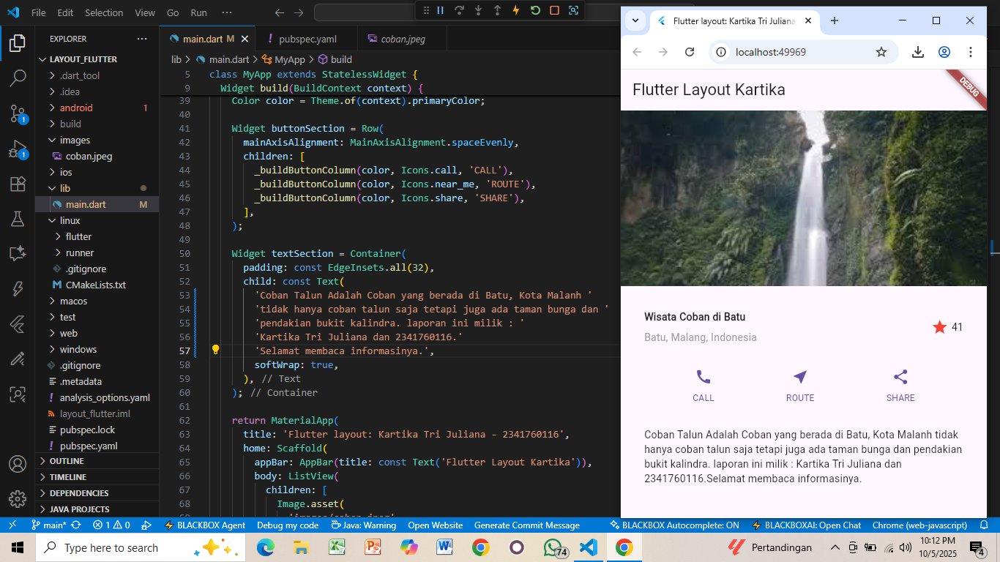

# Praktikum Flutter — Layout dan Navigasi

**Mata Kuliah:** Pemrograman Mobile  
**Nama:** Kartika Tri Juliana  
**NIM:** 2341760116  
**Kelas:** SIB 3C  
**No Absen:** 19

**Repository:** [layout-flutter] https://github.com/kartika3juli15/layout_flutter.git

---

## Praktikum 1: Membangun Layout di Flutter
- Buatlah sebuah project flutter baru dengan nama 'layout_flutter'.
- Buka file main.dart lalu ganti dengan kode berikut. Isi nama dan NIM Anda di text title.
 

- Tambahkan kode berikut di bagian atas metode build() di dalam kelas MyApp
/* soal 1 */ Letakkan widget Column di dalam widget Expanded agar menyesuaikan ruang yang tersisa di dalam widget Row. Tambahkan properti crossAxisAlignment ke CrossAxisAlignment.start sehingga posisi kolom berada di awal baris.

/* soal 2 */ Letakkan baris pertama teks di dalam Container sehingga memungkinkan Anda untuk menambahkan padding = 8. Teks ‘Batu, Malang, Indonesia' di dalam Column, set warna menjadi abu-abu.

/* soal 3 */ Dua item terakhir di baris judul adalah ikon bintang, set dengan warna merah, dan teks "41". Seluruh baris ada di dalam Container dan beri padding di sepanjang setiap tepinya sebesar 32 piksel. Kemudian ganti isi body text ‘Hello World' dengan variabel titleSection seperti berikut:
  

---

## Praktikum 2: Implementasi button row
- Buat method Column _buildButtonColumn  

- Buat widget buttonSection

---

## Praktikum 3: Implementasi text section
- Buat widget textSection  
- Tambahkan variabel text section ke body 

  
---

## Praktikum 4: Implementasi image section
- Siapkan aset gambar

- Tambahkan gambar ke body
- Terakhir, ubah menjadi ListView

## Praktikum 5: Membangun Navigasi di Flutter
- Siapkan project baru, buatlah sebuah project baru Flutter dengan nama belanja
- Mendefinisikan Route Buatlah dua buah file dart dengan nama home_page.dart dan item_page.dart pada folder pages. Untuk masing-masing file, deklarasikan class HomePage pada file home_page.dart dan ItemPage pada item_page.dart. Turunkan class dari StatelessWidget.
- Lengkapi Kode di main.dart
- Membuat data model
- Lengkapi kode di class HomePage
- Membuat ListView dan itemBuilder
- Menambahkan aksi pada ListView
---